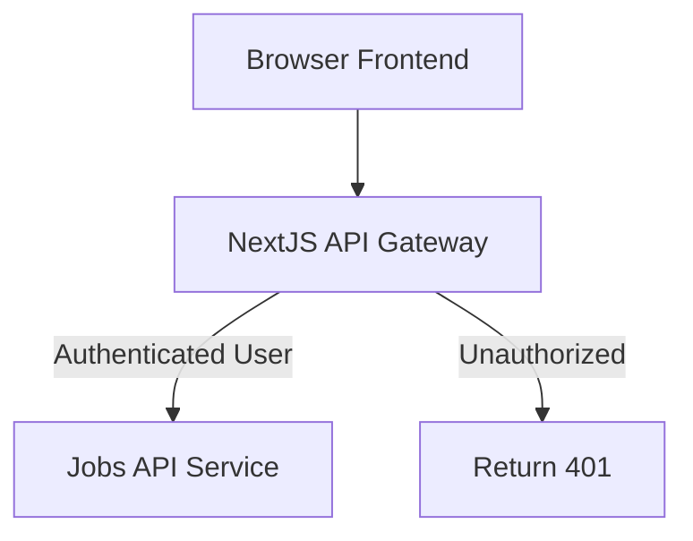

# 🔥 1. **API Gateway з Next.js**



# 🔐 2. Middleware для **internal API key** (Jobs API)

Це код, який захищає твій Jobs Service.
Будь-який запит без коректного ключа — відсікається до виконання логіки.

Повністю робочий приклад (Fastify):

```ts
// src/middleware/internalAuth.ts
import { FastifyRequest, FastifyReply } from 'fastify';

const INTERNAL_KEY = process.env.INTERNAL_API_KEY!;

export async function internalAuth(req: FastifyRequest, reply: FastifyReply) {
  const headerKey = req.headers['x-internal-key'];

  if (!headerKey || headerKey !== INTERNAL_KEY) {
    return reply.status(401).send({
      ok: false,
      error: 'UNAUTHORIZED_INTERNAL_REQUEST',
    });
  }
}
```

### Підключення:

```ts
fastify.addHook('preHandler', internalAuth);
```

### Використання (Next.js → Jobs API):

```ts
await fetch(JOBS_URL + '/run', {
  method: 'POST',
  headers: {
    'x-internal-key': process.env.INTERNAL_API_KEY!,
    'content-type': 'application/json',
  },
  body: JSON.stringify(payload),
});
```

---

# 🔐 3. Middleware для USER AUTH у Next.js (gateway рівень)

Next.js має підтверджувати:

- userId
- role
- access token

і потім _сам_ передавати їх у Jobs API.

### Приклад для Next.js Route Handler (App Router):

```ts
// app/api/run-ai-job/route.ts
import { NextRequest, NextResponse } from 'next/server';
import { auth } from '@/lib/auth'; // твоє auth рішення

export async function POST(req: NextRequest) {
  const session = await auth(req);
  if (!session) {
    return NextResponse.json({ ok: false, error: 'UNAUTHORIZED' }, { status: 401 });
  }

  const body = await req.json();

  const trustedPayload = {
    ...body,
    userId: session.user.id,
    role: session.user.role,
  };

  const r = await fetch(process.env.JOBS_API_URL + '/run', {
    method: 'POST',
    headers: {
      'x-internal-key': process.env.INTERNAL_API_KEY!,
      'content-type': 'application/json',
    },
    body: JSON.stringify(trustedPayload),
  });

  const result = await r.json();
  return NextResponse.json(result);
}
```

---

# ✅ Явна заборона всіх браузерних доменів\*\*

```ts
// src/plugins/corsDeny.ts
import { FastifyPluginAsync } from 'fastify';

export const corsDeny: FastifyPluginAsync = async (fastify) => {
  fastify.addHook('onRequest', (req, reply, done) => {
    const origin = req.headers.origin;

    // Якщо запит прийшов з браузера — блокуємо
    if (origin) {
      reply.code(403).send({
        ok: false,
        error: 'CORS_FORBIDDEN',
        message: 'This service is not accessible from browsers.',
      });
      return;
    }

    done();
  });
};
```

Реєстрація:

```ts
await fastify.register(corsDeny);
```
