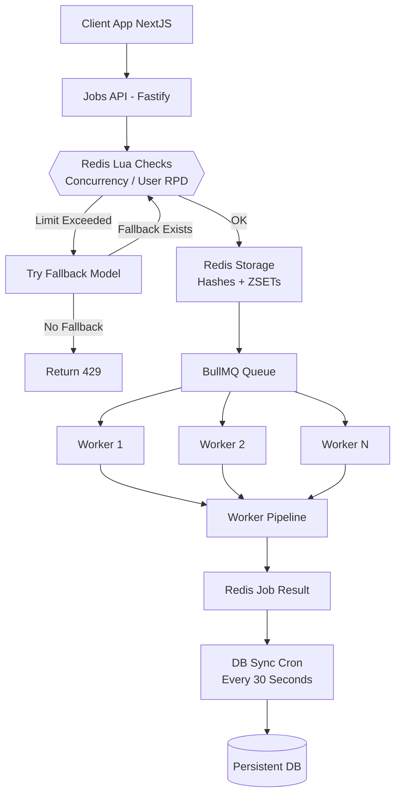
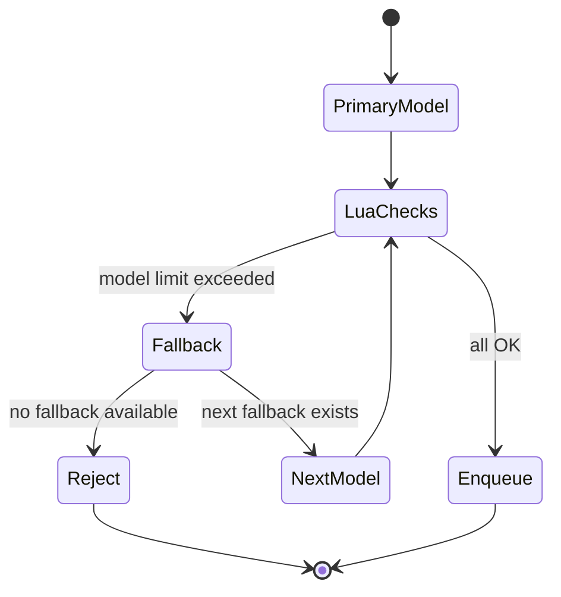
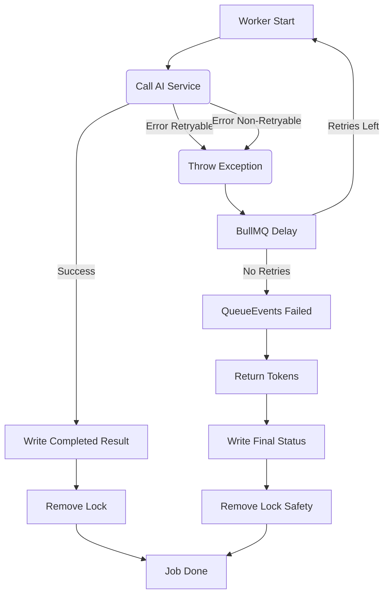

# 🧱 1. **System Overview**

Цей сервіс — окремий Docker-модуль, що складається з:

| Компонент                      | Призначення                                                                                                          |
| :----------------------------- | :------------------------------------------------------------------------------------------------------------------- |
| **Fastify API Server**         | Приймає запити на запуск AI job, обирає модель + fallback-ланцюжок, викликає Lua для user RPD + concurrency, backpressure |
| **BullMQ Queue (lite/hard)**   | Окремі черги для lite/hard режимів                                                                                   |
| **Worker Pool**                | Виконує задачі, взаємодіє з AI, застосовує модельні RPM/RPD, керує retry                                             |
| **Redis**                      | Тимчасове зберігання job metadata, лічильники RPD/RPM, waiting counters, concurrency locks                           |
| **DB Sync Cron**               | SCAN + батчевий перенос завершених job з Redis → persistent DB                                                       |
| **Cleanup Cron**               | Прибирає orphan locks / stale jobs, повертає ліміти                                                                  |

Сервіс гарантує:

- **конкурентність лише в межах лімітів (per-user)**
- **ізольований high-performance API**
- **атомарність user RPD + concurrency в Redis (Lua)**
- **fallback моделі на API-шарі до enqueue**
- **автоматичні retry через BullMQ для retryable помилок**
- **детерміноване збереження результатів у БД**
- **стійкість до збоїв, рестартів, райдужних днів**

---

# 🧩 2. **High-Level Architecture Diagram**



---

# ⚙️ 3. **Core Functional Goals**

| Feature                           | Guarantee                                                                             |
| :-------------------------------- | :------------------------------------------------------------------------------------ |
| **Global Model Limits (RPM/RPD)** | Моделі не перевантажуються (списуються у воркері; RPM → delayed, RPD → fail)          |
| **User Daily RPD (Fixed Window)** | API бере токен через Lua (до enqueue)                                                 |
| **User Concurrency (ZSET TTL)**   | API тримає активні job-и з TTL ~31 хв, чистить зомбі в Lua і воркері                  |
| **Queue Backpressure**            | Для кожної моделі є `queue:waiting:{model}` + динамічний `maxQueueLength` (~30 хв SLA) |
| **Fallback**                      | Моделі автоматично зміщуються вниз по пріоритету **в API-шарі** до постановки в чергу |
| **Retry**                         | AI retryable → BullMQ delay; non-retryable/limit → негайний fail                      |
| **Token Return**                  | Модельні токени повертаються при фінальному фейлі/відпрацюванні QueueEvents           |
| **DB Persistence**                | Жодна job не губиться                                                                 |
| **Zero Downtime Reconfiguration** | Model limits hot-reload                                                               |
| **Scalability**                   | До 20–50k RPS без великих змін                                                        |
| **Fault Tolerance**               | Worker crash → job requeued, lock auto-expire                                         |

---

# 🔥 4. **API-Level Fallback FSM (Pre-Enqueue)**

API-level fallback працює до enqueue і контролює:
- user RPD (per mode) + concurrency
- backpressure по моделі
- доступність моделі (наявність limits)



---

# 👷‍♂️ 5. **Worker-Level FSM (Post-Enqueue)**

Логіка **Fallback** відсутня. Логіка **Retry** повністю делегована BullMQ. Модельні ліміти застосовуються тут.



---

# 🕒 6. **Timestamp Policy**

Всі timestamp-и — UTC

Використовуються у Locks, Job Results, Per-User RPD

---

# 🗄️ 7. **Redis Schema (Detailed)**

## 7.1 Model Limits (HASH)

```
model:{name}:limits
  rpm
  rpd
  updated_at
```

## 7.2 Per-user RPD (ZSET TTL)

```
user:{id}:rpd:{lite|hard}:{YYYY-MM-DD} = counter (string)
```

## 7.3 Queue Waiting per Model (STRING)

```
queue:waiting:{model} = current enqueued/waiting count
```

## 7.4 Concurrency Locks (ZSET)

```
user:{id}:active_jobs
  member: jobId
  score: expiry_timestamp (ms)
```

Self-cleaning on every write.

## 7.5 Job Metadata (HASH)

```
job:{id}:meta
  user_id
  model
  created_at
  updated_at
  attempts
  mode_type
  requested_model
  processed_model
  status
```

## 7.6 Job Result (HASH)

```
job:{id}:result
  status
  error
  error_code
  finished_at
  data (JSON string)
  used_model
```

---

# 🧠 8. **Lua Scripts (Atomic Enforcement)**

## 8.1 combinedCheckAndAcquire (API: user RPD + concurrency)

```lua
-- KEYS[1]=user:rpd:{type}:{date}, KEYS[2]=user:active_jobs
-- ARGV: user_day_limit, concurrency_limit, day_ttl, lock_ttl, consume, now_ms, jobId
redis.call('ZREMRANGEBYSCORE', KEYS[2], '-inf', now_ms)
if concurrency_limit > 0 and redis.call('ZCARD', KEYS[2]) >= concurrency_limit then return 0 end
if user_day_limit > 0 and getOrZero(KEYS[1]) + consume > user_day_limit then return -4 end
if concurrency_limit > 0 then redis.call('ZADD', KEYS[2], now_ms + lock_ttl*1000, jobId) end
if user_day_limit > 0 then redis.call('INCRBY', KEYS[1], consume); redis.call('EXPIRE', KEYS[1], day_ttl) end
return 1
```

## 8.2 consumeExecutionLimits (Worker: model RPM/RPD, optional user RPD)

RPM → -1, RPD → -2, user RPD → -3, інакше 1; при перевищенні RPM воркер ставить delayed на TTL ключа.

---

# 🏗️ 9. **Worker Execution Pipeline** (Виправлено)

1.  Позначає job “in_progress” (`job:meta`).
2.  Викликає **`ModelProviderService.execute`** (виконує лише одну модель).
3.  Якщо **успіх** → записує результат (`job:result`) та **видаляє concurrency lock**.
4.  Якщо **429/5xx (retryable)** → кидає виняток, **BullMQ** ставить job на **delayed retry**.
5.  Якщо **не-retryable (4xx) або вичерпано спроби** → BullMQ переводить у `failed`.
6.  **`queueEvents.on('failed')`** спрацьовує → **повертає токени** (`returnTokens`) та записує фінальний статус `failed`.

---

# 📦 10. **DB Sync Architecture**

Cron (30 seconds):

1.  `SCAN job:*:result` батчами (chunk 200)
2.  merge(meta + result)
3.  batch insert → DB (upsert)
4.  delete Redis keys

Guarantees:

- DB never overloaded (batch writes)
- Redis remains light
- no duplicates (idempotent writes)

---

# 🧨 11. **Failure Modes**

| Failure              | Behaviour                                                                    |
| :------------------- | :--------------------------------------------------------------------------- |
| Redis down           | System permissive, auto-recovery                                            |
| Worker crash         | job requeued, lock auto-expires                                             |
| API crash            | stateless, locks unaffected                                                 |
| DB temporary down    | Redis keeps data until next sync                                            |
| Cron failure         | next run resumes processing                                                 |
| **Final Job Failed** | **Модельні токени повертаються; status=failed записується**                  |
| Stale jobs           | Cron `expireStaleJobs` знімає waiting/locks/RPD, виставляє error_code=expired |

---

# 📈 12. **Scalability Roadmap**

| Stage      | Architecture                                       |
| :--------- | :------------------------------------------------- |
| 1–5k RPS   | Single Redis, 1 queue                              |
| 5–20k RPS  | Single Redis, 1 BullMQ Queue, N Workers            |
| 20–50k RPS | Single Redis (bigger) or Dragonfly, queue sharding |
| 50k+ RPS   | Dragonfly or Redis Cluster (optional)              |
| 150k+ RPS  | Redis Cluster (true distributed limits)            |
| 250k+ RPS  | Multi-region, geo-distributed, per-region shard    |

---

# 🩺 13. **Health Checks**

`GET /health` reports:

- Redis connectivity
- BullMQ queue status
- worker count
- memory & CPU
- uptime

---

# 💀 14. **Graceful Shutdown**

API & Worker:

1.  Stop accepting new jobs
2.  Finish active work
3.  Close queue
4.  Close Redis
5.  Exit cleanly

---

# 📄 15. **Relation to README.md**

| File                | Purpose                                    |
| :------------------ | :----------------------------------------- |
| **README.md**       | User-facing overview, diagrams, usage      |
| **Architecture.md** | Deep internal specification for developers |
| **APIService**      | Info about API Service                     |
| **docs/**           | MkDocs/GitBook extended documentation      |
