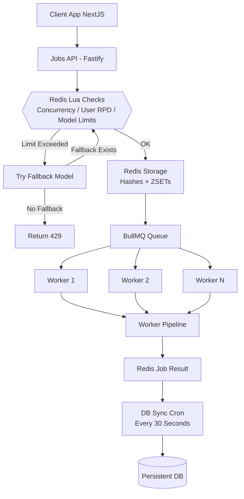
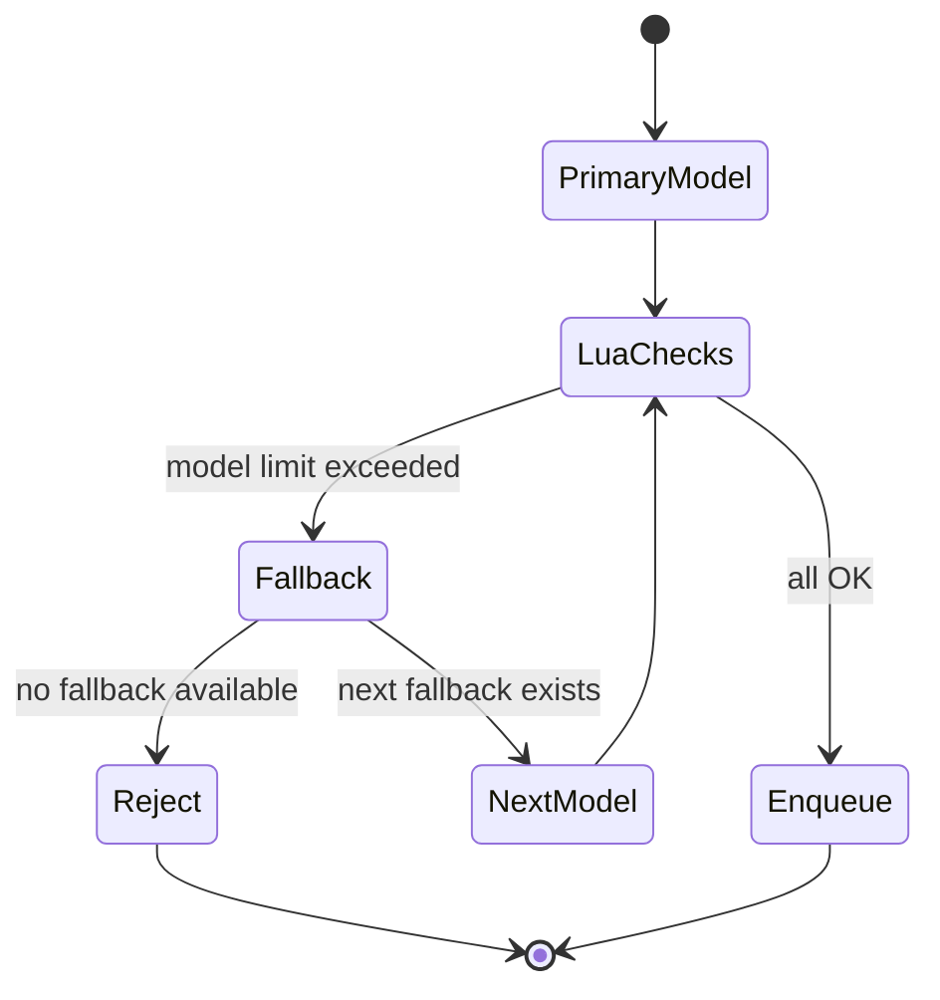
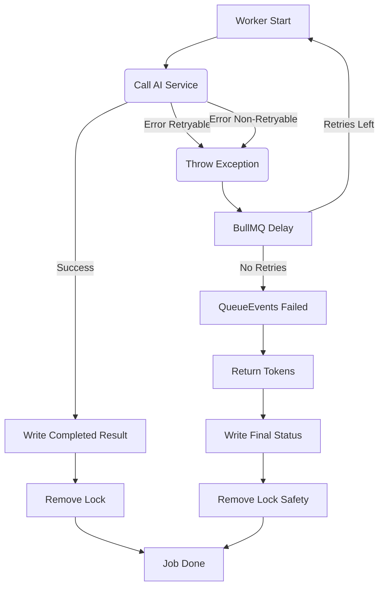

# 🧱 1. **System Overview**

Цей сервіс — окремий Docker-модуль, що складається з:

| Компонент                      | Призначення                                                                                                |
| :----------------------------- | :--------------------------------------------------------------------------------------------------------- |
| **Fastify API Server**         | Приймає запити на запуск AI job, викликає Lua checks, аплаює fallback **(для вибору моделі)**, enqueue job |
| **BullMQ Queue**               | Системна черга задач                                                                                       |
| **Worker Pool**                | Виконує задачі, взаємодіє з AI моделями, **керує retry**                                                   |
| **Redis**                      | Тимчасове зберігання job metadata, concurrency locks, модельні ліміти                                      |
| **DB Sync Cron**               | Регулярно переносить завершені job з Redis → persistent DB                                                 |
| **CDN + Browser Cache Layers** | Захист для зниження навантаження                                                                           |

Сервіс гарантує:

- **конкурентність лише в межах лімітів**
- **ізольований high-performance API**
- **атомарність перевірок у Redis (Lua)**
- **раціональний fallback** (на етапі вибору моделі)
- **автоматичні retry через BullMQ**
- **детерміноване збереження результатів у БД**
- **стійкість до збоїв, рестартів, райдужних днів**

---

# 🧩 2. **High-Level Architecture Diagram**



---

# ⚙️ 3. **Core Functional Goals**

| Feature                           | Guarantee                                                                             |
| :-------------------------------- | :------------------------------------------------------------------------------------ |
| **Global Model Limits (RPM/RPD)** | Моделі не перевантажуються (токен списується **в API** на етапі вибору моделі)        |
| **User Daily RPD (Fixed Window)** | Користувач ніколи не обійде денний ліміт (скидається о 00:00 PT)                      |
| **Concurrency (ZSET TTL)**        | Немає подвійних lock, нема zombie                                                     |
| **Fallback**                      | Моделі автоматично зміщуються вниз по пріоритету **в API-шарі** до постановки в чергу |
| **Retry**                         | AI 429/5xx → delayed retry **(керований BullMQ для однієї обраної моделі)**           |
| **Token Return**                  | Токени RPD/RPM повертаються у разі фінального провалу завдання                        |
| **DB Persistence**                | Жодна job не губиться                                                                 |
| **Zero Downtime Reconfiguration** | Model limits hot-reload                                                               |
| **Scalability**                   | До 20–50k RPS без великих змін                                                        |
| **Fault Tolerance**               | Worker crash → job requeued, lock auto-expire                                         |

---

# 🔥 4. **API-Level Fallback FSM (Pre-Enqueue)**

API-level fallback працює до того, як job потрапляє в чергу.
Тому fallback на цьому рівні контролює:

- ліміти моделей
- ліміти юзера
- concurrency
- доступність моделей

<!-- end list -->



---

# 👷‍♂️ 5. **Worker-Level FSM (Post-Enqueue)**

Логіка **Fallback** відсутня. Логіка **Retry** повністю делегована BullMQ.



---

# 🕒 6. **Timestamp Policy**

Всі timestamp-и — UTC

Використовуються у Locks, Job Results, Per-User RPD

---

# 🗄️ 7. **Redis Schema (Detailed)**

## 7.1 Model Limits (HASH)

```
model:{name}:limits
  rpm
  rpd
  updated_at
```

## 7.2 Per-user RPD (HASH) (Fixed Window)

```
user:{id}:daily:{YYYY-MM-DD}
  used_rpd
```

## 7.3 Concurrency Locks (ZSET)

```
user:{id}:active_jobs
  member: jobId
  score: expiry_timestamp (ms)
```

Self-cleaning on every write.

## 7.4 Job Metadata (HASH)

```
job:{id}:meta
  user_id
  model
  created_at
  updated_at
  attempts
```

## 7.5 Job Result (HASH)

```
job:{id}:result
  status
  error
  finished_at
  data (JSON string)
```

---

# 🧠 8. **Lua Scripts (Atomic Enforcement)**

## 8.1 Concurrency Lock

```lua
redis.call('ZREMRANGEBYSCORE', KEYS[1], '-inf', ARGV[1])
local count = redis.call('ZCARD', KEYS[1])
if count >= tonumber(ARGV[3]) then return 0 end
local expiry = tonumber(ARGV[1]) + tonumber(ARGV[2])
redis.call('ZADD', KEYS[1], expiry, ARGV[4])
return 1
```

Ensures:

- no SCAN required
- no race conditions
- no zombie locks

## 8.2 User RPD (Fixed Window HASH)

Ми використовуємо Lua-скрипт `combinedCheckAndAcquire` для **атомарної** перевірки та інкременту лічильників. Логіка RPD тут спростилася до `HINCRBY` та встановлення TTL.

**Logic:** Check if the current value + 1 exceeds the limit. If not, increment and set TTL (if key is new).

```lua
-- RPD/RPM checks are combined into one script: combinedCheckAndAcquire
--
-- RPD Logic snippet (KEY[4], ARGV[4]=limit, ARGV[7]=dayTtl, ARGV[8]=cost)
local rpd_current = redis.call('HGET', KEYS[4], 'count')
if not rpd_current then rpd_current = 0 end
if rpd_current + ARGV[8] > tonumber(ARGV[4]) then return -4 end -- USER_RPD_EXCEEDED
redis.call('HINCRBY', KEYS[4], 'count', ARGV[8])
redis.call('EXPIRE', KEYS[4], ARGV[7]) -- Set TTL until midnight
-- ... інші лічильники
```

---

# 🏗️ 9. **Worker Execution Pipeline** (Виправлено)

1.  Позначає job “in_progress” (`job:meta`).
2.  Викликає **`ModelProviderService.execute`** (виконує лише одну модель).
3.  Якщо **успіх** → записує результат (`job:result`) та **видаляє concurrency lock**.
4.  Якщо **429/5xx (retryable)** → кидає виняток, **BullMQ** ставить job на **delayed retry**.
5.  Якщо **не-retryable (4xx) або вичерпано спроби** → BullMQ переводить у `failed`.
6.  **`queueEvents.on('failed')`** спрацьовує → **повертає токени** (`returnTokens`) та записує фінальний статус `failed`.

---

# 📦 10. **DB Sync Architecture**

Cron (30 seconds):

1.  `SCAN job:*:result`
2.  merge(meta + result)
3.  batch insert → DB
4.  delete Redis keys

Guarantees:

- DB never overloaded (batch writes)
- Redis remains light
- no duplicates (idempotent writes)

---

# 🧨 11. **Failure Modes**

| Failure              | Behaviour                               |
| :------------------- | :-------------------------------------- |
| Redis down           | System permissive, auto-recovery        |
| Worker crash         | job requeued, lock auto-expires         |
| API crash            | stateless, locks unaffected             |
| DB temporary down    | Redis keeps data until next sync        |
| Cron failure         | next run resumes processing             |
| **Final Job Failed** | **Токени RPD/RPM повертаються у Redis** |

---

# 📈 12. **Scalability Roadmap**

| Stage      | Architecture                                       |
| :--------- | :------------------------------------------------- |
| 1–5k RPS   | Single Redis, 1 queue                              |
| 5–20k RPS  | Single Redis, 1 BullMQ Queue, N Workers            |
| 20–50k RPS | Single Redis (bigger) or Dragonfly, queue sharding |
| 50k+ RPS   | Dragonfly or Redis Cluster (optional)              |
| 150k+ RPS  | Redis Cluster (true distributed limits)            |
| 250k+ RPS  | Multi-region, geo-distributed, per-region shard    |

---

# 🩺 13. **Health Checks**

`GET /health` reports:

- Redis connectivity
- BullMQ queue status
- worker count
- memory & CPU
- uptime

---

# 💀 14. **Graceful Shutdown**

API & Worker:

1.  Stop accepting new jobs
2.  Finish active work
3.  Close queue
4.  Close Redis
5.  Exit cleanly

---

# 📄 15. **Relation to README.md**

| File                | Purpose                                    |
| :------------------ | :----------------------------------------- |
| **README.md**       | User-facing overview, diagrams, usage      |
| **Architecture.md** | Deep internal specification for developers |
| **APIService**      | Info about API Service                     |
| **docs/**           | MkDocs/GitBook extended documentation      |
