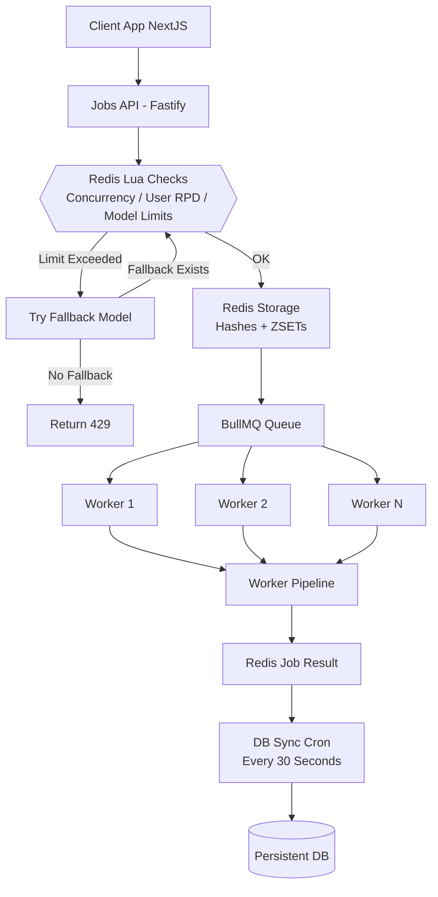
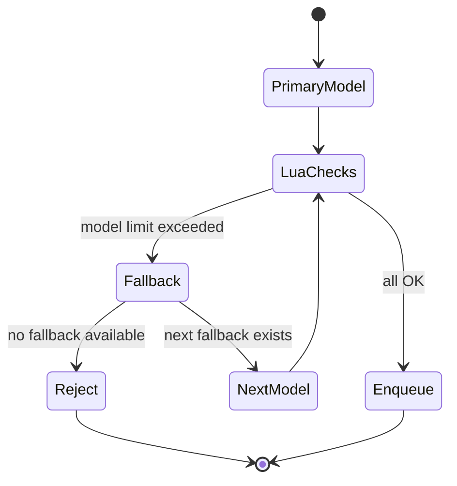
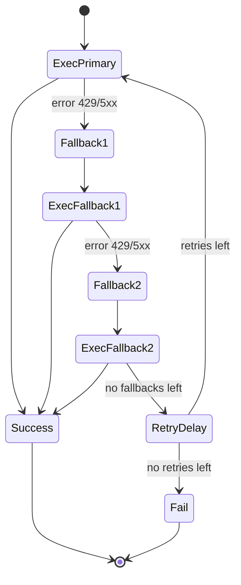
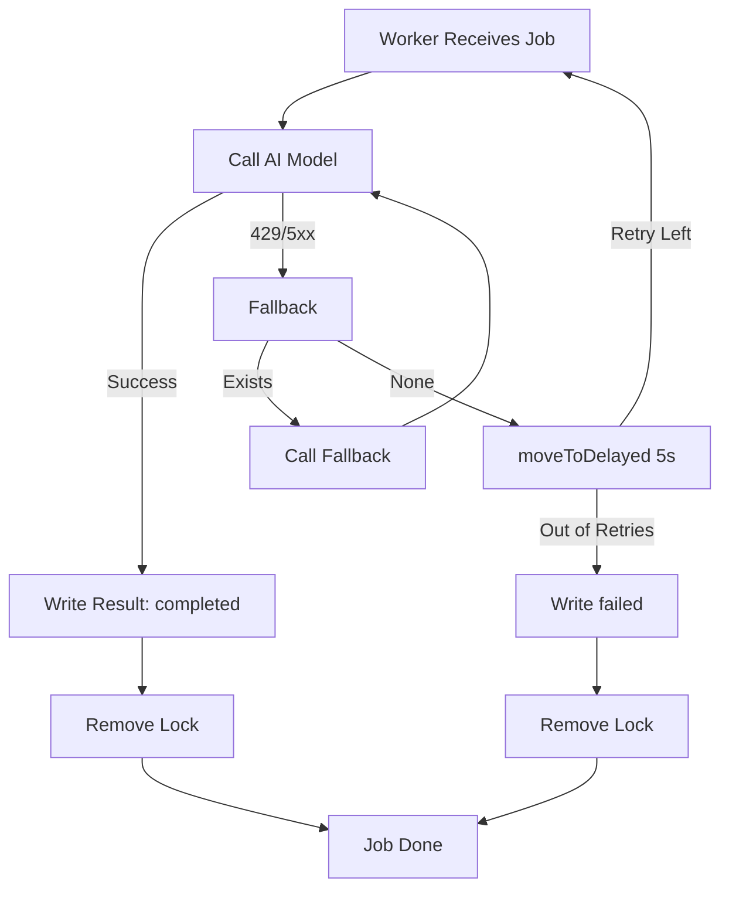

# 🧱 1. **System Overview**

Цей сервіс — окремий Docker-модуль, що складається з:

| Компонент                      | Призначення                                                                        |
| ------------------------------ | ---------------------------------------------------------------------------------- |
| **Fastify API Server**         | Приймає запити на запуск AI job, викликає Lua checks, аплаює fallback, enqueue job |
| **BullMQ Queue**               | Системна черга задач                                                               |
| **Worker Pool**                | Виконує задачі, взаємодіє з AI моделями, fallback / retry / delayed                |
| **Redis**                      | Тимчасове зберігання job metadata, concurrency locks, модельні ліміти              |
| **DB Sync Cron**               | Регулярно переносить завершені job з Redis → persistent DB                         |
| **CDN + Browser Cache Layers** | Захист для зниження навантаження                                                   |

Сервіс гарантує:

- **конкурентність лише в межах лімітів**
- **ізольований high-performance API**
- **атомарність перевірок у Redis (Lua)**
- **раціональний fallback**
- **автоматичні retry через BullMQ**
- **детерміноване збереження результатів у БД**
- **стійкість до збоїв, рестартів, райдужних днів і кривих рук**

---

# 🧩 2. **High-Level Architecture Diagram**



---

# ⚙️ 3. **Core Functional Goals**

| Feature                             | Guarantee                                        |
| ----------------------------------- | ------------------------------------------------ |
| **Global Model Limits (RPM/RPD)**   | Моделі не перевантажуються                       |
| **User Daily RPD (rolling window)** | Користувач ніколи не обійде денний ліміт         |
| **Concurrency (ZSET TTL)**          | Немає подвійних lock, нема zombie                |
| **Fallback**                        | Моделі автоматично зміщуються вниз по пріоритету |
| **Retry**                           | AI 429/5xx → delayed retry                       |
| **DB Persistence**                  | Жодна job не губиться                            |
| **Zero Downtime Reconfiguration**   | Model limits hot-reload                          |
| **Scalability**                     | До 20–50k RPS без великих змін                   |
| **Fault Tolerance**                 | Worker crash → lock auto-expire                  |

---

# 🔥 4. **API-Level Fallback FSM (Pre-Enqueue)**

API-level fallback працює до того, як job потрапляє в чергу.
Тому fallback на цьому рівні контролює:

- ліміти моделей
- ліміти юзера
- concurrency
- доступність моделей



---

# 👷‍♂️ 5. **Worker-Level Fallback FSM (Post-Enqueue)**

Коли модель дала помилку → Worker викликає fallback.



---

# 🕒 6. **Timestamp Policy**

Всі timestamp-и — UTC

Використовуються у Locks, Job Results, Per-User RPD

---

# 🗄️ 7. **Redis Schema (Detailed)**

## 7.1 Model Limits (HASH)

```
model:{name}:limits
  rpm
  rpd
  updated_at
```

## 7.2 Per-user rolling RPD (HASH)

```
user:{id}:daily:{YYYY-MM-DD}
  used_rpd
  updated_at
```

## 7.3 Concurrency Locks (ZSET)

```
user:{id}:active_jobs
  member: jobId
  score: expiry_timestamp (ms)
```

Self-cleaning on every write.

## 7.4 Job Metadata (HASH)

```
job:{id}:meta
  user_id
  model
  created_at
  updated_at
  attempts
```

## 7.5 Job Result (HASH)

```
job:{id}:result
  status
  error
  finished_at
  data (JSON string)
```

---

# 🧠 8. **Lua Scripts (Atomic Enforcement)**

## 8.1 Concurrency Lock

```lua
redis.call('ZREMRANGEBYSCORE', KEYS[1], '-inf', ARGV[1])
local count = redis.call('ZCARD', KEYS[1])
if count >= tonumber(ARGV[3]) then return 0 end
local expiry = tonumber(ARGV[1]) + tonumber(ARGV[2])
redis.call('ZADD', KEYS[1], expiry, ARGV[4])
return 1
```

Ensures:

- no SCAN required
- no race conditions
- no zombie locks

## 8.2 User RPD

(rolling window)

```lua
local current = redis.call('HGET', KEYS[1], 'used_rpd')
if not current then current = 0 else current = tonumber(current) end
if current + tonumber(ARGV[1]) > tonumber(ARGV[2]) then return 0 end
redis.call('HINCRBY', KEYS[1], 'used_rpd', ARGV[1])
redis.call('HSET', KEYS[1], 'updated_at', ARGV[3])
return 1
```

---

# 🏗️ 9. **Worker Execution Pipeline**

1. Позначає job “in_progress”
2. Підтягує актуальні model limits
3. Викликає AI модель
4. Якщо success → записує результат
5. Якщо 429/5xx → fallback → retry → delayed retry
6. Видаляє concurrency lock
7. Синхронізує result у Redis

---

# 🔁 10. **Worker-Level Diagram**



---

# 📦 11. **DB Sync Architecture**

Cron (30 seconds):

1. `SCAN job:*:result`
2. merge(meta + result)
3. batch insert → DB
4. delete Redis keys

Guarantees:

- DB never overloaded (batch writes)
- Redis remains light
- no duplicates (idempotent writes)

---

# 🧨 12. **Failure Modes**

| Failure           | Behaviour                        |
| ----------------- | -------------------------------- |
| Redis down        | System permissive, auto-recovery |
| Worker crash      | job requeued, lock auto-expires  |
| API crash         | stateless, locks unaffected      |
| DB temporary down | Redis keeps data until next sync |
| Cron failure      | next run resumes processing      |

---

# 📈 13. **Scalability Roadmap**

| Stage      | Architecture                                       |
| ---------- | -------------------------------------------------- |
| 1–5k RPS   | Single Redis, 1 queue                              |
| 5–20k RPS  | Single Redis, 1 BullMQ Queue, N Workers            |
| 20–50k RPS | Single Redis (bigger) or Dragonfly, queue sharding |
| 50k+ RPS   | Dragonfly or Redis Cluster (optional)              |
| 150k+ RPS  | Redis Cluster (true distributed limits)            |
| 250k+ RPS  | Multi-region, geo-distributed, per-region shard    |

---

# 🩺 14. **Health Checks**

`GET /health` reports:

- Redis connectivity
- BullMQ queue status
- worker count
- memory & CPU
- uptime

---

# 💀 15. **Graceful Shutdown**

API & Worker:

1. Stop accepting new jobs
2. Finish active work
3. Close queue
4. Close Redis
5. Exit cleanly

---

# 📄 16. **Relation to README.md**

| File                | Purpose                                    |
| ------------------- | ------------------------------------------ |
| **README.md**       | User-facing overview, diagrams, usage      |
| **Architecture.md** | Deep internal specification for developers |
| **APIService**      | Info about API Service                     |
| **docs/**           | MkDocs/GitBook extended documentation      |

---

Задачі поділяються за складністю аналізу. Чи складніший аналіз ти більше полів обробляється + використовуються різні моделі. Ліміти моделей - (мають братися з БД при старті серверу) Сервіс має мати job яка буде брати нові ліміти раз в 12 годин з БД при цьому на час взяття нових лімітів - черга припиняється (обробка нових задач). const MODEL_LIMITS = { // from db pro2dot5: { rpm: 2, rpd: 50, }, // hard flash: { rpm: 10, rpd: 250, }, // hard flashPreview: { rpm: 10, rpd: 250, }, // lite flashLite: { rpm: 15, rpd: 1000, }, // lite flashLitePreview: { rpm: 15, rpd: 1000, } // lite }; const fallbackPriorityHard = [pro2dot5,flash,flashPreview,]; const fallbackPriorityLite = [flashLitem,flashLitePreview]; Ліміти для користувачів - Одночасні аналізи - role=user: max_concurrent_jobs=2 role=admin: no limits (only model limits) Ліміти на запуск - role=user: hard: rpd: 1 light: rpd: 9 role=admin: no limits (only model limits)
