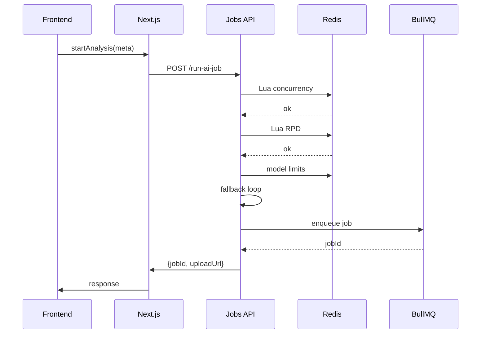
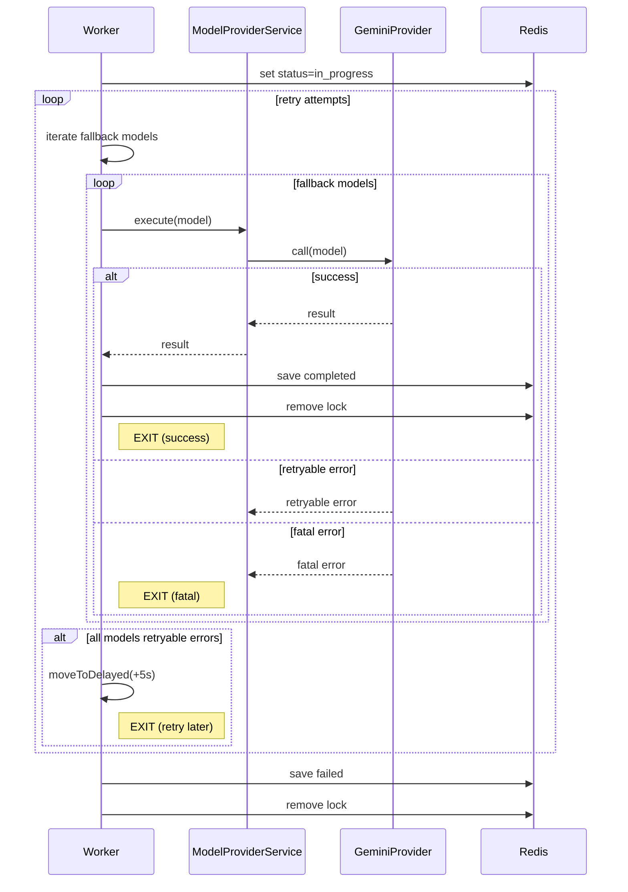
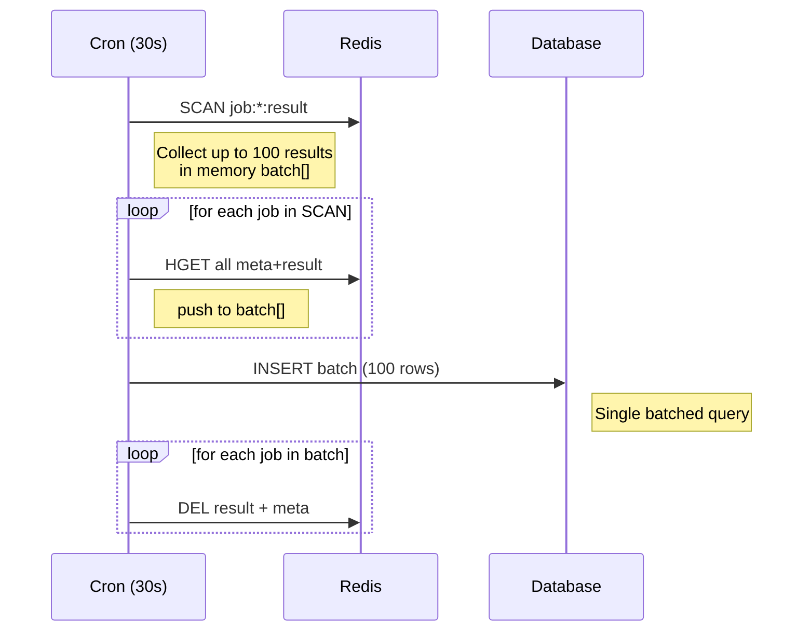

# 📁 **DEVELOPMENT_TASKS.md — Full Engineering Breakdown (Final Integrated Version)**

### AI Model Execution Queue System

**Version: 2.0 — Fully Consolidated Document**

---

# 📚 Зміст

0. Epic 0 — Init project (add dependencies)
1. Epic 1 — Database Schema
2. Epic 2 — Redis Schema + Lua
3. Epic 3 — Jobs API
4. Epic 4 — Worker Engine + AI Provider
5. Epic 5 — Cron Jobs
6. Epic 6 — Storage Flow
7. Epic 7 — Security
8. Epic 8 — Observability
9. Work Dependencies
10. Independent tasks
11. Sequence Diagrams

---

# 🧱 **Epic 0 — Init project (add dependencies)**

## **Task 0.1 — init project**

1. add fastify, @google/genai, typescript, eslint, prettier, @supabase/supabase-js, immer. (install types for them)
2. setup prettier + eslint + typescript
3. add build, start, test, fix format (eslint + prettier) script.

---

# 🧱 **Epic 1 — Database Schema (Resume, Job, AI Models, User Limits, Usage)**

_(Може бути реалізовано незалежно від усіх інших епіків)_

---

## **Task 1.1 — Create `ai_models` table**

| field             | type                | description                        |
| ----------------- | ------------------- | ---------------------------------- |
| id                | text                | model key (`flashLite`, `pro3`, …) |
| provider          | text                | `"gemini"`                         |
| api_name          | text                | `"gemini-2.5-flash-lite"`          |
| type              | enum("hard","lite") |                                    |
| rpm               | int                 |                                    |
| rpd               | int                 |                                    |
| fallback_priority | int                 | lower = preferred                  |
| created_at        | timestamp           |                                    |
| updated_at        | timestamp           |                                    |

### AC:

- Table exists
- Seeds inserted for all models
- Cron #1 loads limits from this table to Redis

---

## **Task 1.2 — Create `resume` table**

| field      | type      |
| ---------- | --------- |
| id         | uuid      |
| user_id    | uuid      |
| file_id    | text      |
| file_name  | text      |
| file_type  | text      |
| file_size  | int       |
| created_at | timestamp |
| updated_at | timestamp |

AC:

- FK(user_id)
- Indexed

---

## **Task 1.3 — Create `job` table**

| field       | type      |
| ----------- | --------- |
| id          | uuid      |
| user_id     | uuid      |
| resume_id   | uuid?     |
| model       | text      |
| status      | text      |
| result      | jsonb     |
| error       | text      |
| created_at  | timestamp |
| finished_at | timestamp |

AC:

- stored after DB Sync cron
- indexed by user and created_at

---

## ⭐ **Task 1.4 — Create `user_limits` table (NEW)**

| field           | type                  |
| --------------- | --------------------- |
| user_id         | uuid                  |
| role            | enum("user","admin")  |
| hard_rpd        | int?                  |
| lite_rpd        | int?                  |
| max_concurrency | int?                  |
| unlimited       | boolean default false |
| created_at      | timestamp             |

### Default Values

**User role:**

```
hard_rpd = 1
lite_rpd = 9
max_concurrency = 2
unlimited = false
```

**Admin role:**

```
unlimited = true
```

AC:

- Next.js seed inserts these defaults on user creation
- Admin bypass logic enforced in Jobs API

---

## **Task 1.5 — Create `user_daily_usage` table**

Not used by runtime, only analytics.

| field    | type |
| -------- | ---- |
| user_id  | uuid |
| date     | date |
| used_rpd | int  |

---

## ⭐ **Task 1.6 — Seed Scripts (Next.js)**

On user creation:

```
POST /api/user-created
 → Insert into user_limits
 → Insert default resume folder entries (optional)
```

AC:

- Works for both user and admin
- No duplicates
- Idempotent

---

# 🧱 **Epic 2 — Redis Schema + Lua Scripts**

---

## **Task 2.1 — Implement Redis Key Schema**

```
model:{name}:limits     → HASH (rpm, rpd)
model:{name}:daily:{date} → HASH (used_rpm, used_rpd)
user:{id}:active_jobs   → ZSET(jobId, expiry_ts)
job:{id}:meta           → HASH
job:{id}:result         → HASH
user:{id}:limits        → HASH (cached from DB)
```

AC:

- Cleaned, consistent prefixes
- UTF timestamps

---

## **Task 2.2 — Concurrency Lock Lua (with admin bypass)**

If admin:

```
return 1
```

Else:

```
ZREMRANGEBYSCORE
ZCARD
ZADD
return 1/0
```

---

## **Task 2.3 — User RPD Rolling Limit Lua (with admin bypass)**

If admin → return 1.

Else:

```
HGET used_rpd
Compare with allowed
HINCRBY
return 1 or 0
```

---

# 🧱 **Epic 3 — Jobs API Layer (Fastify)**

---

## **Task 3.1 — Fastify project structure**

```
src/
  server.ts
  plugins/
    redis.ts
    auth.ts
    corsDeny.ts
  routes/
    jobs.ts
    health.ts
  services/
    limitsCache.ts
    modelSelector.ts
```

---

## **Task 3.2 — Internal Auth Middleware**

Rules:

- must include `x-internal-api-key`
- if `Origin` header → block (403)
- Next.js communicates server-to-server → no CORS

AC:

- secure
- simple
- no public access

---

## **Task 3.3 — Endpoint: POST /run-ai-job**

Flow:

1. Validate payload
2. Load user_limits from Redis or DB
3. Admin bypass logic
4. Lua concurrency check
5. Lua RPD check
6. Model limits from Redis
7. Fallback loop
8. Create BullMQ job
9. Set job:{id}:meta
10. Return:

```
{ jobId, uploadUrl?, fileId? }
```

---

## **Task 3.4 — GET /job/:jobId**

Reads:

1. Redis
2. Fallback DB

Returns:

```
{ status, data, error, finished_at }
```

---

## **Task 3.5 — /healthz**

Return:

```
redis: ok
queuePaused: false
workers: N
ram: normal
cpu: normal
uptime: ms
```

---

# 🧱 **Epic 4 — Worker Engine + AI Provider**

---

## ⭐ **Task 4.0 — Create ModelProviderService**

Folder:

```
src/ai/
  ModelProviderService.ts
  providers/
    GeminiProvider.ts (ported from Next.js)
  schema/
    SchemaService.ts (ported)
```

Purpose:

- unify model fallback logic
- workers call AI through this layer
- dynamic model selection

---

## ⭐ **Task 4.1 — Port SchemaService from Next.js**

Changes:

- remove React store dependencies
- remove UI-specific logic
- convert to pure TS class
- expose only: `getGenAiSchema()`

---

## ⭐ **Task 4.2 — Implement GeminiProvider (ported)**

Must handle:

- buildPromptSettings
- JSON schema injection
- deterministic config
- safety settings
- error normalization:

  - 429 → throw { status: 429 }
  - 503 → throw { status: 500 }

Model name comes from:

```
job.model → ai_models.api_name
```

---

## **Task 4.3 — Implement fallback chain**

Worker:

```
for model in chain:
    try run model
    if OK break
if all failed:
    job.moveToDelayed
```

---

## **Task 4.4 — Worker Job Pipeline**

1. Set status=in_progress
2. Load schema
3. Construct prompt
4. Call AI
5. Fallback logic
6. Save result to Redis
7. Remove concurrency lock

---

## **Task 4.5 — Graceful Shutdown**

Worker must:

- stop accepting new jobs
- finish current job
- close Redis + queue

---

# 🧱 **Epic 5 — Cron Jobs**

---

## **Task 5.1 — Cron: Model Limits Reload (every 5min)**

Flow:

```
SELECT * FROM ai_models
HSET model:{name}:limits
```

Zero downtime — no pause of workers.

---

## **Task 5.2 — Cron: DB Sync (every 30s)**

```
SCAN job:*:result
HGET meta
INSERT batch
DEL result + meta
```

AC:

- idempotent
- fast
- parallelisable

---

## **Task 5.3 — Cron: Orphan Lock Cleanup (1h)**

```
SCAN user:*:active_jobs
if job completed → ZREM
```

---

# 🧱 **Epic 6 — Storage Flow (In next sprint / not now) **

---

## **Task 6.1 — Generate signed upload URL**

Next.js:

```
POST /start-analysis
 → Jobs API validates → returns signed URL + jobId
```

---

## **Task 6.2 — Frontend**

Upload file asynchronously
Job executes even if file upload never finished.

---

## **Task 6.3 — Worker**

If file present → optional usage
If missing → still analyze using parsedText

---

# 🧱 **Epic 7 — Security Layer**

---

## **Task 7.1 — Disable CORS fully**

Reject Origin header.

---

## **Task 7.2 — Internal API key middleware**

---

# 🧱 **Epic 8 — Observability** (In next sprint / not now)

---

## **Task 8.1 — Logging: Pino or another**

---

## **Task 8.2 — Prometheus metrics**

---

## **Task 8.3 — Error tracking (Sentry)**

---

# 🔀 **Dependencies Map**

| Task         | Depends on                                          |
| ------------ | --------------------------------------------------- |
| DB schema    | none                                                |
| ai_models    | none                                                |
| user_limits  | none                                                |
| Redis schema | DB admin flag                                       |
| Lua scripts  | Redis schema                                        |
| Jobs API     | Lua scripts + DB                                    |
| Worker       | ai_models + SchemaService                           |
| Crons        | Worker (for DB sync), ai_models (for limits reload) |

---

# 📈 **Independent Tasks**

### Fully independent:

- DB schema
- ai_models
- user_limits
- Redis schema
- Lua
- Observability
- Storage flow

### Partially independent:

- Worker engine (needs ai_models + SchemaService)
- Jobs API (needs Lua + user_limits)

---

# 🧬 **Sequence Diagrams**

---

## **1️⃣ Job Creation Flow**



---

## **2️⃣ Worker AI Execution Flow** (need decompose diagram)



---

## **3️⃣ DB Sync Cron**


