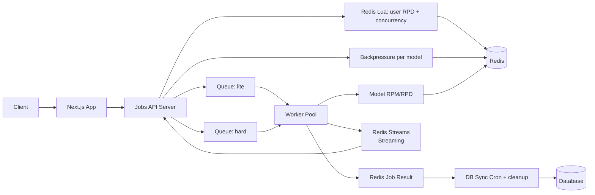

# 🚀 **AI Resume analyzer Service — Queue + Worker + API Backend**

## This service is the core of the AI analysis execution system.

It processes jobs considering:

- **Real-time Streaming** (SSE) — resilient low-latency UX
- **Model Limits** (RPM / RPD) — enforced by the worker
- **User Limits** (daily RPD) + **Concurrency** — enforced by the API via Lua
- **Model Backpressure** (`queue:waiting` + dynamic `maxQueueLength`)
- **Model Fallback** (prior to enqueue)
- **Retry** (BullMQ-native)
- **Atomic Redis Lua scripts**
- **Durable Job Result State**
- **Batch DB Synchronization**
- **HTTP API** for starting jobs

> **This is NOT a Next.js API.**
> Next.js only proxies requests to this service.

---

# 📚 Table of Contents

1.  Architecture
2.  Data Flow
3.  Redis Structures
4.  Lua Scripts (Atomic)
5.  HTTP API (Fastify)
6.  Worker Pipeline
7.  Cron Tasks
8.  Health Check
9.  Graceful Shutdown
10. Folder structure

---

# 🧩 1. Architecture Diagram



---

# 🔄 2. Data Flow

### **1) HTTP API: Standard vs Streaming**

- **Payload validation**: Model selection + fallback logic (prior to enqueue).
- **Lua `combinedCheckAndAcquire`**:
  - Validates user RPD (Rate Per Day) based on mode (lite/hard).
  - Acquires a concurrency lock in a ZSET.
  - Performs a soft model RPD pre-check.
- **Backpressure**: Checks if `queue:waiting:{model}` exceeds dynamic `maxQueueLength` (\~30 min SLA).
- **Enqueueing**:
  - **Standard (`/analyze`)**: Enqueues job and returns `{ jobId }` immediately. Client polls `/result` or connects to стрім.
  - **Streaming Mode**: To use streaming, client sends `"streaming": true` in `/analyze` payload and connects to `/:id/result-stream`.

### **2) Worker Execution**

- **Limit Consumption**: Lua `consumeExecutionLimits` checks and consumes model RPM/RPD.
- **Execution**:
  - **Standard**: Calls `modelProvider.execute()`, waits for full result.
  - **Streaming**: Calls `modelProvider.executeStream()`. Each chunk received from AI is:
    1. Added to Redis Stream `job:stream:{jobId}` via `XADD`.
    2. Appended to a local buffer in the worker to form the full result.
- **Completion**:
  - On success: Worker adds `{"type":"done"}` to the stream, writes full result to Redis `job:{id}:result`, and updates metadata.
  - On failure: Worker adds `{"type":"error"}` to the stream, triggers token refund (if AI wasn't reached), and marks status as `failed`.

### **3) DB Synchronization (Cron every 5 min)**

- **SCAN `job:*:result`**: Collects all completed jobs.
- **Persistence**: Batch upsert results into the persistent Database.
- **TTL Management**: After sync, the TTL of Redis keys is reduced from 24h to 5 minutes.
- **Resilience**: Meta-only jobs older than ~35m (orphans) are persisted as `failed/missing_result` to ensure the UI doesn't hang forever.

### **4) Dynamic Worker Concurrency**

- Values are read from Redis `config:worker:{lite|hard}:concurrency`.
- Workers use Pub/Sub `config:update` to hot-reload concurrency without restarts.
- BullMQ stalled detection ensures jobs are recycled if a worker process dies unexpectedly.

---

# 🗄 3. Redis Structures

### Model Limits

```
model:{model}:limits
  rpm
  rpd
  api_name
```

### Model Catalog

```
models:ids (SET) = list of model ids loaded from DB
```

### User Daily RPD (STRING with TTL)

```
user:{id}:rpd:{lite|hard}:{YYYY-MM-DD} = counter (string)
```

### Concurrency Control

```
user:{id}:active_jobs → ZSET(jobId, expiry_ts)
```

### Job Metadata

```
job:{id}:meta
  user_id
  model
  created_at
  updated_at
  attempts
  mode_type
  requested_model
  processed_model
  status
  streaming (true|false)
  TTL: ~24h at creation, then 5m after DB sync
```

### Job Result

```
job:{id}:result
  status
  error
  finished_at
  data
  used_model
  synced_at (after DB sync)
  TTL: ~24h at creation, then 5m after DB sync
```

### Job Stream (STREAM)

```
job:stream:{id}
  Entry: { "data": "JSON_STRING" }
  TTL: 15m (active) / 5m (completed)
```

---

# 🔥 4. Lua Scripts (Summary)

- `combinedCheckAndAcquire`: cleans up zombie locks, checks user RPD + concurrency, sets lock in ZSET, increments user RPD, checks model RPD (without consuming); returns code OK / CONCURRENCY / USER_RPD / MODEL_RPD.
- `consumeExecutionLimits`: atomically checks and consumes model RPM/RPD.
- `decrAndClampToZero`: decrements a numeric key and clamps the value at 0 (used for queue counters).
- `returnTokensAtomic`: atomically returns RPM/RPD/user RPD tokens with TTL updates; safe to call when jobs are cancelled/expired/failed.
- `expireStaleJob`: removes old waiting/delayed jobs, decrements queue/user counters, marks job meta/result as `failed/expired`, and stamps `expired_at`.

---

# 🛰 5. HTTP API (Fastify)

This service has an HTTP API for integration with Next.js / other backends.

## POST `/resume/analyze`

Starts the analysis. Returns `{ jobId }`.
Payload: `{ "payload": { ... }, "streaming": boolean }`.

## POST `/resume/:id/result-stream`

Universal entry point for **resilient streaming** (SSE).

- **Adaptive Polling**: Closes immediately if job is in queue (`status: queued`) to save server resources.
- **Snapshot Logic**: Sends full accumulated history for new or F5 connections.
- **Delta Resumption**: Supports `lastEventId` in request body to resume after disconnect.
- **Hierarchical Fallback**: Checks Redis Result $\rightarrow$ Redis Meta $\rightarrow$ DB.

## GET `/resume/:id/status`

Returns: `queued`, `in_progress`, `completed`, `failed`.

## GET `/resume/:id/result`

Returns: `{ status, data?, error?, finished_at, used_model? }`.

## POST `/admin/worker-concurrency`

Updates worker concurrency without deployment (requires internal API key):
`{ "queue": "lite" | "hard", "concurrency": 12 }`

## POST `/admin/update-models-limits`

Update models limits from DB (requires internal API key):

## GET `/health`

Checks:

- Redis access
- Queue paused
- Worker alive
- Memory/CPU usage

---

# ⚙️ 6. Worker Logic (High Level)

- Consume model RPM/RPD (Lua `consumeExecutionLimits`).
- Resolve provider model name from Redis `model:{id}:limits.api_name`.
- **Streaming Detection**: If `job.data.streaming === true`, use `executeStream()` and add chunks to Redis Stream.
- Retryable errors (500/503/504, etc.) $\rightarrow$ BullMQ retry/delay (`attempts=2`).
- Non-retryable errors $\rightarrow$ `UnrecoverableError` $\rightarrow$ failed, token refund, lock release.

---

# ⏱ 7. Cron Tasks

## **DB Sync Cron (every 5 min)**

1. SCAN `job:*:result`.
2. Batch write to DB.
3. Mark synced and shorten TTL to ~5m.

## **Model Limit Refresh (every X min)**

Updates `model:{name}:limits` from DB.

## **Orphan Lock Cleanup (hourly)**

- SCAN `user:*:active_jobs`.
- Removes `jobID`s that are not present in BullMQ.

---

# 🩺 8. Health Check

`GET /health` reports:

- Redis/DB connectivity.
- Queue readiness + worker counts.
- Memory/CPU/Uptime metrics.

```json
{
  "db": "ok",
  "redis": "ok",
  "queue": "ok",
  "workers": 3,
  "uptime": 551232,
  "cpu": "normal",
  "memory": "normal",
  "queueState": { "ready": "queueReady", "paused": "litePaused || hardPaused" },
  "db_pool": {
    "total": 10,
    "waiting": 3
  },
  "metrics": {
    "ram_rss_mb": 120,
    "cpu_load_1m": 2,
    "uptime_s": 53223123
  }
}
```

---

# 📴 9. Graceful Shutdown

1. Stop accepting new jobs.
2. Finish active work.
3. Close BullMQ Queues and Redis connections.
4. Wait active sync DB job and close DB connection.
5. Exit process.

---

# 📁 10. Folder structure

```text
root
├── src
│   ├── ai              // provider implementations and selection logic
│   ├── config          // env parsing and configuration helpers
│   ├── constants       // shared constants (TTL, limits, etc.)
│   ├── cron            // scheduled tasks (sync DB, cleanup, expire stale jobs)
│   ├── db              // database client and queries
│   ├── plugins         // Fastify plugins (redis, db, shutdown, etc.)
│   ├── redis           // redis client, keys, Lua scripts
│   ├── routes          // HTTP routes (resume, admin, health)
│   ├── server.ts       // Fastify bootstrap
│   ├── services        // domain services (user limits preload, etc.)
│   ├── types           // shared TypeScript types
│   ├── utils           // helper utilities
│   └── worker          // BullMQ worker entrypoint and pipeline
├── docs
│   ├── Architecture.md
│   ├── RateLimits.md
│   ├── TESTS.md
│   └── Worker.md
├── supabase
│   ├── config.toml
│   ├── helpers
│   ├── migrations
│   └── seed.sql
├── test
│   ├── integration
│   ├── mock
│   ├── unit
│   └── utils
├── scripts
│   ├── createAdminUser.ts
│   └── makeAdminExisting.ts
├── README.md
├── Dockerfile
├── docker-compose.develop.yml
├── docker-compose.test.yml
├── eslint.config.cjs
├── fly.redis.toml
├── fly.toml
├── package.json
├── tsconfig.build.json
├── tsconfig.json
└── vitest.config.ts
...
```
