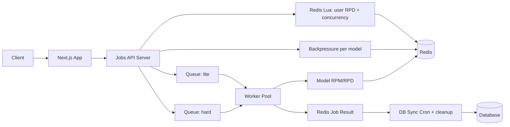

Чудовий опис. Переклад з урахуванням технічної термінології та збереженням структури Markdown:

# 🚀 **AI Jobs Service — Queue + Worker + API Backend**

This service is the core of the AI analysis execution system.
It processes jobs considering:

- **Model Limits** (RPM / RPD) — enforced by the worker
- **User Limits** (daily RPD) + **Concurrency** — enforced by the API via Lua
- **Model Backpressure** (`queue:waiting` + dynamic `maxQueueLength`)
- **Model Fallback** (prior to enqueue)
- **Retry** (BullMQ-native)
- **Atomic Redis Lua scripts**
- **Durable Job Result State**
- **Batch DB Synchronization**
- **HTTP API** for starting jobs

> **This is NOT a Next.js API.**
> Next.js only proxies requests to this service.

---

# 📚 Table of Contents

1.  Architecture
2.  Data Flow
3.  Redis Structures
4.  Lua Scripts (Atomic)
5.  HTTP API (Fastify)
6.  Worker Pipeline
7.  Cron Tasks
8.  Health Check
9.  Graceful Shutdown

---

# 🧩 1. Architecture Diagram



---

# 🔄 2. Data Flows

### **1) HTTP API receive job**

- Payload validation, model selection + fallback
- Lua `combinedCheckAndAcquire`: user RPD (per mode) + concurrency lock + model RPD pre-check
- Backpressure: `queue:waiting:{model}` does not exceed dynamic `maxQueueLength` (\~30 min SLA) and is not greater than model RPD
- Write job meta, enqueue into lite/hard queue

### **2) Worker execution**

- Lua `consumeExecutionLimits`: model RPM/RPD (user RPD=0, as it was already deducted in the API)
- If RPM is exceeded — delayed; if RPD is exceeded — fail
- Call AI, record result, release counters/locks

### **3) Cron**

- SCAN `job:*:result` $\rightarrow$ batch upsert to DB, delete keys
- Cleanup orphan locks
- `expireStaleJobs` (long waiting/delayed $\rightarrow$ expired, release counters)

### **3) DB sync**

```
Redis Results → Batch Cron → DB
```

### **4) Dynamic Worker Concurrency**

- Current values are read from Redis `config:worker:{lite|hard}:concurrency`.
- Admin can update via `/admin/worker-concurrency`; workers immediately pick up the change via Pub/Sub `config:update`.
- Defaults: `lite=8`, `hard=3` (if keys are absent).

---

# 🗄 3. Redis Structures

### Model Limits

```
model:{model}:limits
  rpm
  rpd
```

### User Daily RPD (STRING with TTL)

```
user:{id}:rpd:{lite|hard}:{YYYY-MM-DD} = counter (string)
```

### Concurrency Control

```
user:{id}:active_jobs → ZSET(jobId, expiry_ts)
```

### Job Metadata

```
job:{id}:meta
  user_id
  model
  created_at
```

### Job Result

```
job:{id}:result
  status
  error
  finished_at
  data
  used_model
```

---

# 🔥 4. Lua Scripts (Summary)

- `combinedCheckAndAcquire`: cleans up zombie locks, checks user RPD + concurrency, sets lock in ZSET, increments user RPD, checks model RPD (without consuming); returns code OK / CONCURRENCY / USER_RPD / MODEL_RPD.
- `consumeExecutionLimits`: atomically checks and consumes model RPM/RPD.

---

# 🛰 5. HTTP API (Fastify)

This service has an HTTP API for integration with Next.js / other backends.

## POST `/resume/analyze`

Starts the analysis.

### Payload:

```ts
{
  userId: string;
  role: 'user' | 'admin';
  payload: object;
}
```

### Logic:

1.  Lua: user RPD (per mode) + concurrency lock
2.  Model selection + fallback (prior to enqueue)
3.  Backpressure per model (`queue:waiting:{model}` + dynamic cap)
4.  Job enqueue into lite/hard queue
5.  Return `{ jobId }`

---

## GET `/resume/:id/status`

Returns:

- `queued`
- `in_progress`
- `completed`
- `failed`

## GET `/resume/:id/result`

Returns:

```ts
{
  status,
  data?,
  error?,
  finished_at,
  used_model?
}
```

## POST `/admin/worker-concurrency`

Updates worker concurrency without deployment (requires internal API key):

```json
{ "queue": "lite" | "hard", "concurrency": 12 }
```

## GET `/health`

Checks:

- Redis access
- Queue paused
- Worker alive
- Memory/CPU usage

---

# ⚙️ 6. Worker Logic (High Level)

- Consume model RPM/RPD (Lua `consumeExecutionLimits`)
- Retryable errors (500/503/504, etc.) $\rightarrow$ BullMQ retry/delay (`attempts=2`)
- Non-retryable errors (400/403/404/429/500 context-too-long) $\rightarrow$ `UnrecoverableError` $\rightarrow$ failed, token refund, lock release
- Release waiting counter / `active_jobs`

---

# ⏱ 7. Cron Tasks

## **DB Sync Cron (every 30s)**

1.  SCAN `job:*:result`
2.  Batch write to DB
3.  DEL processed Redis keys

## **Model Limit Refresh (every X min)**

Updates:

```
model:{name}:limits
```

## **Orphan Lock Cleanup (hourly)**

- SCAN `user:*:active_jobs`
- Removes `jobID`s that are not present in BullMQ

---

# 🩺 8. Health Check

```json
{
  "redis": "ok",
  "queue": "running",
  "workers": 3,
  "uptime": 551232,
  "cpu": "normal",
  "memory": "normal"
}
```

---

# 📴 9. Graceful Shutdown

```ts
async function shutdown() {
  await worker.close();
  await queue.close();
  await redis.quit();
  process.exit(0);
}
process.on('SIGINT', shutdown);
process.on('SIGTERM', shutdown);
```

---

# 🎉 Finished

Thank you for reading until the end 💘
