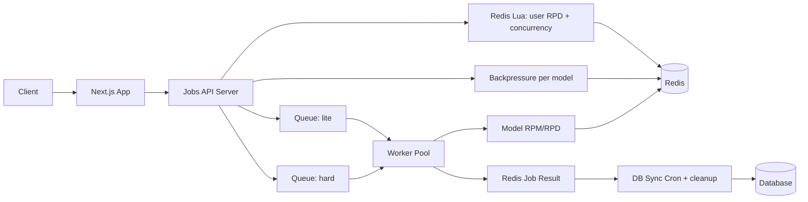

# 🚀 **AI Jobs Service — Queue + Worker + API Backend**

Цей сервіс — це ядро системи виконання AI-аналізу.
Він обробляє задачі з урахуванням:

- модельних лімітів (RPM / RPD) — застосовує воркер
- лімітів користувачів (daily RPD) + concurrency — застосовує API через Lua
- backpressure по моделі (queue:waiting + динамічний maxQueueLength)
- fallback моделей (до enqueue)
- retry (BullMQ-native)
- atomic Redis Lua scripts
- durable job result state
- batch DB synchronization
- HTTP API для запуску задач

> **Це НЕ Next.js API.**
> Next.js лише проксить запити в цей сервіс.

---

# 📚 Зміст

1. Архітектура
2. Потік даних
3. Redis структури
4. Lua скрипти (atomic)
5. HTTP API (Fastify)
6. Worker pipeline
7. Cron tasks
8. Health check
9. Graceful shutdown

---

# 🧩 1. Архітектурна діаграма



---

# 🔄 2. Потоки даних

### **1) HTTP API receive job**

- Валідація payload, вибір моделі + fallback
- Lua `combinedCheckAndAcquire`: user RPD (per mode) + concurrency lock + модельний RPD pre-check
- Backpressure: `queue:waiting:{model}` не перевищує динамічний maxQueueLength (~30 хв SLA) і не більше ніж model RPD
- Запис job meta, enqueue у lite/hard

### **2) Worker execution**

- Lua `consumeExecutionLimits`: модельні RPM/RPD (user RPD=0, бо списано в API)
- Якщо RPM перевищено — delayed; якщо RPD перевищено — fail
- Виклик AI, запис результату, зняття лічильників/локів

### **3) Cron**

- SCAN job:\*:result → батч upsert у БД, видалення ключів
- cleanup orphan locks
- expireStaleJobs (довгі waiting/delayed → expired, зняття лічильників)

### **3) DB sync**

```
Redis Results → Batch Cron → DB
```

### **4) Динамічний concurrency воркерів**

- Поточні значення читаються з Redis `config:worker:{lite|hard}:concurrency`.
- Адмін може оновити через `/admin/worker-concurrency`; воркери одразу підхоплюють через Pub/Sub `config:update`.
- Дефолти: lite=8, hard=3 (якщо ключі відсутні).

---

# 🗄 3. Redis Структури

### Model Limits

```
model:{model}:limits
  rpm
  rpd
```

### User Daily RPD (STRING with TTL)

```
user:{id}:rpd:{lite|hard}:{YYYY-MM-DD} = counter (string)
```

### Concurrency Control

```
user:{id}:active_jobs → ZSET(jobId, expiry_ts)
```

### Job Metadata

```
job:{id}:meta
  user_id
  model
  created_at
```

### Job Result

```
job:{id}:result
  status
  error
  finished_at
  data
  used_model
```

---

# 🔥 4. Lua Скрипти (тезисно)

- `combinedCheckAndAcquire`: чистить зомбі-локи, перевіряє user RPD + concurrency, ставить lock у ZSET, інкрементує user RPD, перевіряє модельний RPD (без списання); повертає код OK / CONCURRENCY / USER_RPD / MODEL_RPD.
- `consumeExecutionLimits`: атомарно перевіряє та споживає модельні RPM/RPD

---

# 🛰 5. HTTP API (Fastify)

Цей сервіс має HTTP API для інтеграції з Next.js / іншими бекендами.

## POST `/resume/analyze`

Запускає аналіз.

### Payload:

```ts
{
  userId: string;
  role: 'user' | 'admin';
  payload: object;
}
```

### Логіка:

1. Lua: user RPD (per mode) + concurrency lock
2. Вибір моделі + fallback (до enqueue)
3. Backpressure per model (`queue:waiting:{model}` + динамічний cap)
4. Job enqueue у lite/hard
5. Повернення `{ jobId }`

---

## GET `/resume/:id/status`

Повертає:

- queued
- in_progress
- completed
- failed

## GET `/resume/:id/result`

Повертає:

```ts
{
  status,
  data?,
  error?,
  finished_at,
  used_model?
}
```

## POST `/admin/worker-concurrency`

Оновлює конкурентність воркерів без деплою (потрібен internal API key):

```json
{ "queue": "lite" | "hard", "concurrency": 12 }
```

## GET `/health`

Перевірка:

- Redis доступ
- Queue paused
- Worker alive
- Memory/CPU usage

---

# ⚙️ 6. Worker Logic (high level)

- consume модельні RPM/RPD (Lua `consumeExecutionLimits`)
- retryable (500/503/504 тощо) → BullMQ retry/delay (attempts=2)
- non-retryable (400/403/404/429/500 context-too-long) → UnrecoverableError → failed, повернення токенів, зняття локів
- release waiting counter / active_jobs

---

# ⏱ 7. Cron Tasks

## **DB Sync Cron (every 30s)**

1. SCAN `job:*:result`
2. batch write в DB
3. DEL processed Redis keys

## **Model Limit Refresh (every X min)**

Оновлює:

```
model:{name}:limits
```

## **Orphan Lock Cleanup (hourly)**

- SCAN `user:*:active_jobs`
- видаляє ті jobID, яких нема в BullMQ

---

# 🩺 8. Health Check

```json
{
  "redis": "ok",
  "queue": "running",
  "workers": 3,
  "uptime": 551232,
  "cpu": "normal",
  "memory": "normal"
}
```

---

# 📴 9. Graceful Shutdown

```ts
async function shutdown() {
  await worker.close();
  await queue.close();
  await redis.quit();
  process.exit(0);
}
process.on('SIGINT', shutdown);
process.on('SIGTERM', shutdown);
```

---

# 🎉 Готово

Дякую що дочитали до кінця 💘
