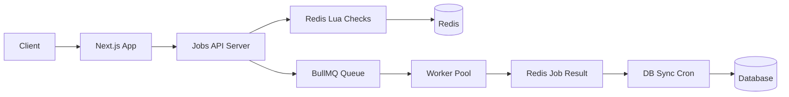
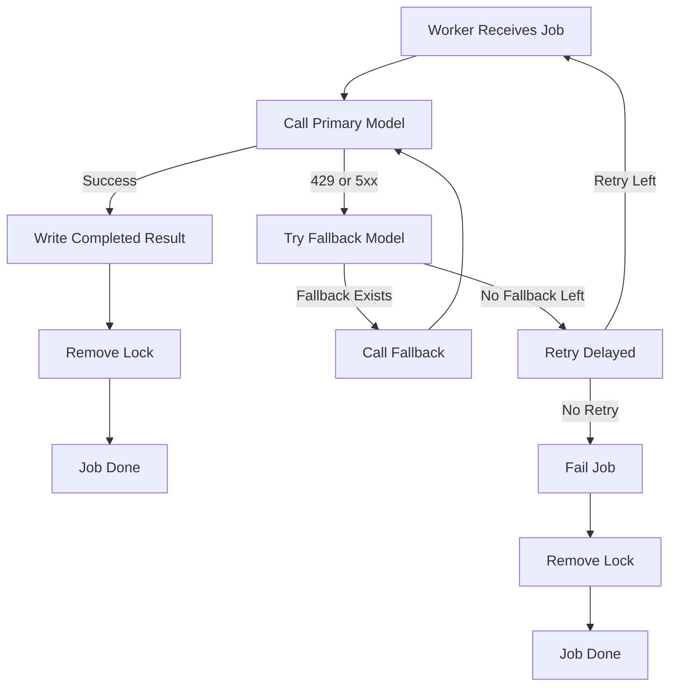

# 🚀 **AI Jobs Service — Queue + Worker + API Backend**

Цей сервіс — це ядро системи виконання AI-аналізу.
Він обробляє задачі з урахуванням:

- модельних лімітів (RPM / RPD)
- лімітів користувачів (daily RPD)
- одночасних задач (concurrency)
- fallback моделей
- retry (BullMQ-native)
- atomic Redis Lua scripts
- durable job result state
- batch DB synchronization
- HTTP API для запуску задач

> **Це НЕ Next.js API.**
> Next.js лише проксить запити в цей сервіс.

---

# 📚 Зміст

1. Архітектура
2. Потік даних
3. Redis структури
4. Lua скрипти (atomic)
5. HTTP API (Fastify)
6. Worker pipeline
7. Worker fallback FSM
8. Cron tasks
9. Health check
10. Graceful shutdown

---

# 🧩 1. Архітектурна діаграма



---

# 🔄 2. Потоки даних

### **1) HTTP API receive job**

```
Client → Next.js → Jobs API → Lua → Redis → Queue
```

### **2) Worker execution**

```
Queue → Worker → AI Model → Redis Result
```

### **3) DB sync**

```
Redis Results → Batch Cron → DB
```

---

# 🗄 3. Redis Структури

### Model Limits

```
model:{model}:limits
  rpm
  rpd
```

### User Daily RPD

```
user:{id}:daily:{YYYY-MM-DD}
  used_rpd
  updated_at
```

### Concurrency Control

```
user:{id}:active_jobs → ZSET(jobId, expiry_ts)
```

### Job Metadata

```
job:{id}:meta
  user_id
  model
  created_at
```

### Job Result

```
job:{id}:result
  status
  error
  finished_at
  data
```

---

# 🔥 4. Lua Скрипти

## Concurrency Check (atomic)

```lua
redis.call('ZREMRANGEBYSCORE', KEYS[1], '-inf', ARGV[1])
local count = redis.call('ZCARD', KEYS[1])
if count >= tonumber(ARGV[3]) then return 0 end
local expiry = tonumber(ARGV[1]) + tonumber(ARGV[2])
redis.call('ZADD', KEYS[1], expiry, ARGV[4])
return 1
```

## User RPD Check

```lua
local current = redis.call('HGET', KEYS[1], 'used_rpd')
if not current then current = 0 else current = tonumber(current) end
if current + tonumber(ARGV[1]) > tonumber(ARGV[2]) then return 0 end
redis.call('HINCRBY', KEYS[1], 'used_rpd', ARGV[1])
redis.call('HSET', KEYS[1], 'updated_at', ARGV[3])
return 1
```

---

# 🛰 5. HTTP API (Fastify)

Цей сервіс має HTTP API для інтеграції з Next.js / іншими бекендами.

## POST `/run`

Запускає аналіз.

### Payload:

```ts
{
  userId: string;
  role: 'user' | 'admin';
  model: string;
  payload: object;
}
```

### Логіка:

1. Concurrency check
2. User RPD check
3. Model limits check
4. Fallback через список моделей
5. Job enqueue
6. Повернення `{ jobId }`

---

## GET `/job/:id/status`

Повертає:

- queued
- in_progress
- completed
- failed

## GET `/job/:id/result`

Повертає:

```ts
{
  status,
  data?,
  error?,
  finished_at
}
```

## GET `/healthz`

Перевірка:

- Redis доступ
- Queue paused
- Worker alive
- Memory/CPU usage

---

# ⚙️ 6. Worker Logic

```ts
try {
  const result = await callModel(payload);

  await redis.hset(`job:${id}:result`, {
    status: 'completed',
    data: JSON.stringify(result),
    finished_at: nowUTC(),
  });

  await removeLock(userId, id);
} catch (err) {
  if (err.status === 429 || err.status >= 500) {
    await job.moveToDelayed(Date.now() + 5000);
    return;
  }

  await redis.hset(`job:${id}:result`, {
    status: 'failed',
    error: err.message,
    finished_at: nowUTC(),
  });

  await removeLock(userId, id);
}
```

---

# 🔁 7. Worker-Level Fallback Diagram



---

# ⏱ 8. Cron Tasks

## **DB Sync Cron (every 30s)**

1. SCAN `job:*:result`
2. batch write в DB
3. DEL processed Redis keys

## **Model Limit Refresh (every X min)**

Оновлює:

```
model:{name}:limits
```

## **Orphan Lock Cleanup (hourly)**

- SCAN `user:*:active_jobs`
- видаляє ті jobID, яких нема в BullMQ

---

# 🩺 9. Health Check

```json
{
  "redis": "ok",
  "queue": "running",
  "workers": 3,
  "uptime": 551232,
  "cpu": "normal",
  "memory": "normal"
}
```

---

# 📴 10. Graceful Shutdown

```ts
async function shutdown() {
  await worker.close();
  await queue.close();
  await redis.quit();
  process.exit(0);
}
process.on('SIGINT', shutdown);
process.on('SIGTERM', shutdown);
```

---

# 🎉 Готово

Дякую що дочитали до кінця 💘
