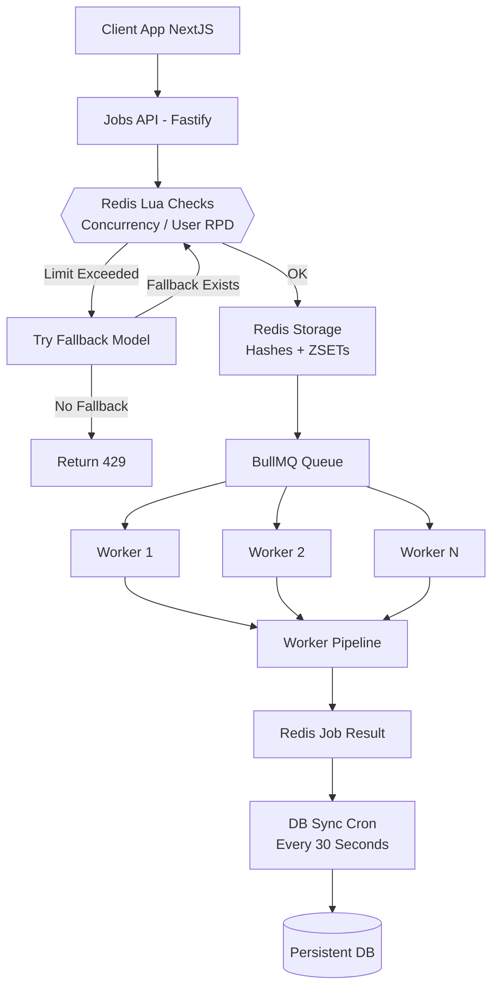
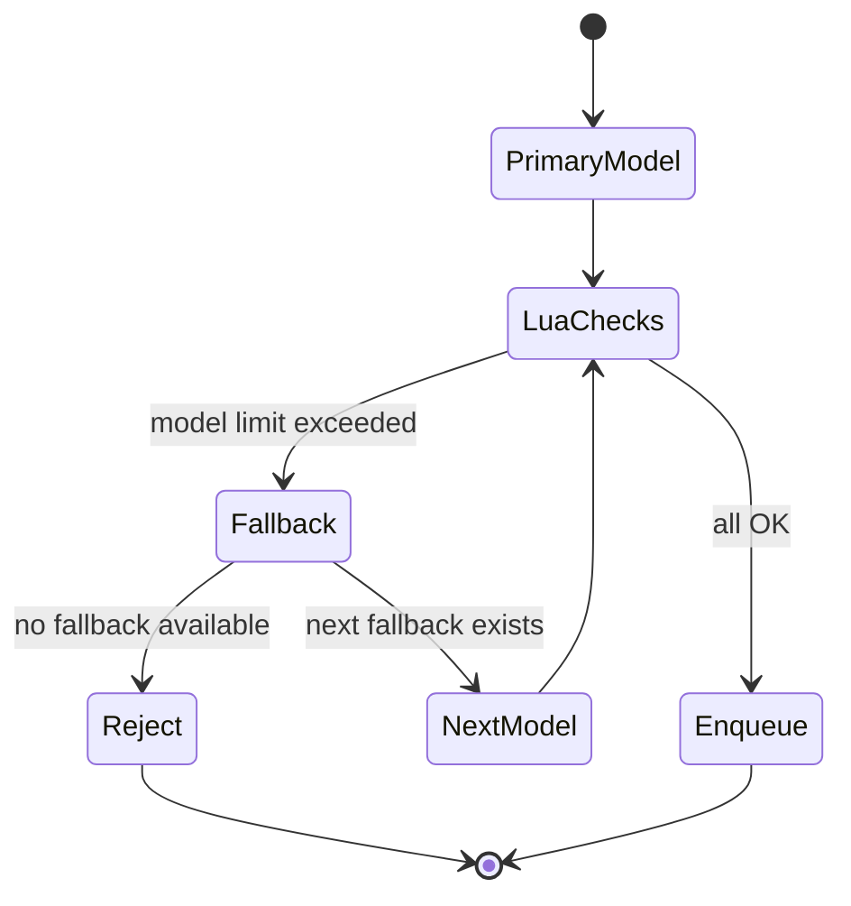
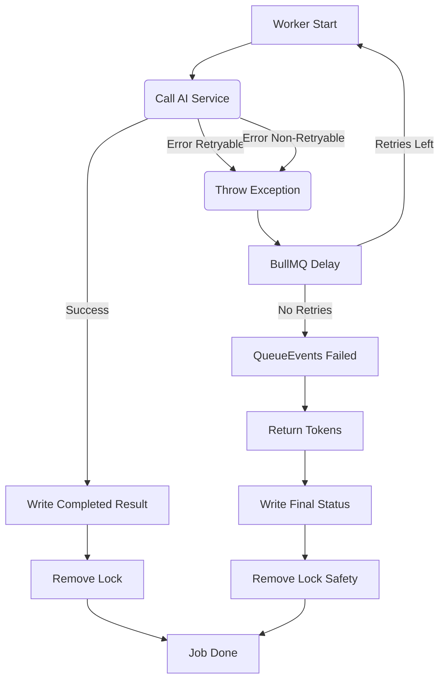

# 🧱 1. **System Overview**

This service is a separate Docker module, consisting of:

| Component                    | Purpose                                                                                                                                                                                              |
| :--------------------------- | :--------------------------------------------------------------------------------------------------------------------------------------------------------------------------------------------------- |
| **Fastify API Server**       | Accepts requests to launch an AI job, selects model + fallback chain, calls Lua for user RPD + concurrency, applies backpressure                                                                     |
| **BullMQ Queue (lite/hard)** | Separate queues for lite/hard modes                                                                                                                                                                  |
| **Worker Pool**              | Executes tasks, interacts with AI, applies model RPM/RPD limits, manages retry logic                                                                                                                 |
| **Redis**                    | Temporary storage for job metadata, RPD/RPM counters, waiting counters, concurrency locks                                                                                                            |
| **DB Sync Cron**             | SCAN + batch transfer of completed jobs from Redis $\rightarrow$ persistent DB; meta/result keys have 24h TTL, shortened to 5 minutes after sync; meta-only older than grace are persisted as failed |
| **Cleanup Cron**             | Removes orphan locks / stale waiting/delayed jobs, refunds limits (active jobs handled by BullMQ stalled checks)                                                                                     |

The service guarantees:

- **Concurrency strictly within limits (per-user)**
- **Isolated high-performance API**
- **Atomic user RPD + concurrency in Redis (Lua)**
- **Model fallback at the API layer prior to enqueue**
- **Automatic retries via BullMQ for retryable errors**
- **Deterministic persistence of results to the DB**
- **Resilience to failures, restarts, and peak load scenarios**

---

# 🧩 2. **High-Level Architecture Diagram**



---

# ⚙️ 3. **Core Functional Goals**

| Feature                           | Guarantee                                                                                             |
| :-------------------------------- | :---------------------------------------------------------------------------------------------------- |
| **Global Model Limits (RPM/RPD)** | Models are not overloaded (consumed in worker; RPM $\rightarrow$ delayed, RPD $\rightarrow$ fail)     |
| **User Daily RPD (Fixed Window)** | API acquires token via Lua (pre-enqueue)                                                              |
| **User Concurrency (ZSET TTL)**   | API maintains active jobs with $\text{TTL} \sim 31 \text{ min}$, cleans up zombies in Lua and worker  |
| **Queue Backpressure**            | Each model has `queue:waiting:{model}` + dynamic `maxQueueLength` ($\sim 30 \text{ min}$ SLA)         |
| **Fallback**                      | Models automatically shift down in priority **at the API layer** before queuing                       |
| **Retry**                         | AI retryable $\rightarrow$ BullMQ delay; non-retryable/limit $\rightarrow$ immediate fail             |
| **Token Return**                  | Model tokens are refunded upon final failure/processing of QueueEvents                                |
| **DB Persistence**                | No job is lost; meta-only jobs older than grace are persisted as failed                               |
| **Zero Downtime Reconfiguration** | Model limits hot-reload                                                                               |
| **Dynamic Worker Concurrency**    | Worker concurrency is read from Redis, updated via Pub/Sub + admin endpoint                           |
| **Stalled Recovery**              | BullMQ stalled detection configured (60s lock/stalled interval, max stalled count 1) for dead workers |
| **Scalability**                   | Up to $\text{20–50k RPS}$ without major changes                                                       |
| **Fault Tolerance**               | Worker crash $\rightarrow$ job requeued, lock auto-expire                                             |

---

# 🔥 4. **API-Level Fallback FSM (Pre-Enqueue)**

API-level fallback works prior to enqueue and controls:

- User RPD (per mode) + concurrency
- Model backpressure
- Model availability (existence of limits)

<!-- end list -->



---

# 👷‍♂️ 5. **Worker-Level FSM (Post-Enqueue)**

**Fallback** logic is absent. **Retry** logic is fully delegated to BullMQ. Model limits are applied here.



---

# 🕒 6. **Timestamp Policy**

All timestamps are UTC

Used in Locks, Job Results, Per-User RPD

---

# 🗄️ 7. **Redis Schema (Detailed)**

## 7.1 Model Limits (HASH)

```
model:{name}:limits
  rpm
  rpd
  api_name
  updated_at
```

## 7.2 Model Catalog (SET)

```
models:ids = list of model ids loaded from DB
```

## 7.3 Per-user RPD (STRING with TTL)

```
user:{id}:rpd:{lite|hard}:{YYYY-MM-DD} = counter (string)
```

## 7.4 Queue Waiting per Model (STRING)

```
queue:waiting:{model} = current enqueued/waiting count
```

## 7.5 Concurrency Locks (ZSET)

```
user:{id}:active_jobs
  member: jobId
  score: expiry_timestamp (ms)
```

Self-cleaning on every write.

## 7.6 Job Metadata (HASH)

```
job:{id}:meta
  user_id
  model
  created_at
  updated_at
  attempts
  mode_type
  requested_model
  processed_model
  status
  TTL: ~24h at creation, shortened to ~5m after DB sync
```

## 7.7 Job Result (HASH)

```
job:{id}:result
  status
  error
  error_code
  finished_at
  data (JSON string)
  used_model
  synced_at (after DB sync)
  TTL: ~24h at creation, shortened to ~5m after DB sync
```

---

# 🧠 8. **Lua Scripts (Atomic Enforcement, Summary)**

- `combinedCheckAndAcquire` (API): cleans up zombie locks, checks user RPD + concurrency, sets lock in ZSET, increments user RPD, performs a model RPD pre-check (without consumption); returns code (OK / CONCURRENCY / USER_RPD / MODEL_RPD).
- `consumeExecutionLimits` (Worker): atomically checks model RPM/RPD and (optionally) user RPD; on RPM overage, returns code for delay; on RPD overage, returns code for fail.

---

# 🏗️ 9. **Worker Execution Pipeline** (Current)

1.  Marks job as "in_progress" (`job:meta`).
2.  Resolves provider model name from `model:{id}:limits.api_name` (loaded from DB at startup).
3.  Calls **`ModelProviderService.execute`** (executes only one model).
4.  If **success** $\rightarrow$ records result (`job:result`) and **removes concurrency lock**.
5.  If **retryable (500/503/504/other temporary errors)** $\rightarrow$ throws exception, **BullMQ** performs backoff retry ($\text{attempts}=2$).
6.  If **non-retryable (400/403/404/429/500 context-too-long)** $\rightarrow$ `UnrecoverableError` $\rightarrow$ BullMQ sets `failed` immediately.
7.  **`queueEvents.on('failed')`** is triggered $\rightarrow$ **refunds tokens** (`returnTokens`) and records final `failed` status.

---

# 📦 10. **DB Sync Architecture**

Cron ($\text{30 seconds}$):

1.  `SCAN job:*:result` in batches ($\text{chunk } 200$)
2.  merge($\text{meta} + \text{result}$)
3.  batch insert $\rightarrow$ DB ($\text{upsert}$)
4.  delete Redis keys

Guarantees:

- DB never overloaded ($\text{batch writes}$)
- Redis remains light
- no duplicates ($\text{idempotent writes}$)

---

# 🧨 11. **Failure Modes**

| Failure              | Behaviour                                                                                  |
| :------------------- | :----------------------------------------------------------------------------------------- |
| Redis down           | System becomes permissive auto-recovery                                                    |
| Worker crash         | Job requeued, lock auto-expires                                                            |
| API crash            | Stateless, locks unaffected                                                                |
| DB temporary down    | Redis retains data until next sync                                                         |
| Cron failure         | Next run resumes processing                                                                |
| **Final Job Failed** | **Model tokens are refunded; status=failed is recorded**                                   |
| Stale jobs           | Cron `expireStaleJobs` removes waiting/locks/RPD, sets $\text{error\_code}=\text{expired}$ |

---

# 📈 12. **Scalability Roadmap**

| Stage      | Architecture                                       |
| :--------- | :------------------------------------------------- |
| 1–5k RPS   | Single Redis, 2 queues (lite/hard)                 |
| 5–20k RPS  | Single Redis, 2 BullMQ Queues, N Workers           |
| 20–50k RPS | Single Redis (bigger) or Dragonfly, queue sharding |
| 50k+ RPS   | Dragonfly or Redis Cluster (optional)              |
| 150k+ RPS  | Redis Cluster (true distributed limits)            |
| 250k+ RPS  | Multi-region, geo-distributed, per-region shard    |

---

# 🩺 13. **Health Checks**

`GET /health` reports:

- Redis connectivity
- DB connectivity (SELECT 1)
- BullMQ queue readiness + paused state
- DB pool metrics (total/waiting)
- Memory & CPU
- Uptime

## 13.1 **Operational Limits & Ratios**

**Worker concurrency defaults**

- `DEFAULT_CONCURRENCY`: `lite=8`, `hard=3` (total 11). Overrides can be applied via Redis config.

**DB pool limits**

- `max=10` (kept below Supabase hard limit 15)
- `idleTimeoutMillis=30000`
- `allowExitOnIdle=true`
- `connectionTimeoutMillis=5000`

**Health check timing chain**

- `connectionTimeoutMillis (5s) < /health REQUEST_TIMEOUT (7s) < Fly http_checks timeout (8s)`
- Fly http_checks `interval=20s` should stay higher than the timeout; `grace_period=20s` allows cold start warm-up

---

# 💀 14. **Graceful Shutdown**

API & Worker:

1.  Stop accepting new jobs
2.  Finish active work
3.  Close queue
4.  Close Redis
5.  Exit cleanly

---

# 📄 15. **Documentation**

| File                | Purpose                                        |
| :------------------ | :--------------------------------------------- |
| **README.md**       | User-facing overview, diagrams, usage          |
| **Architecture.md** | Deep internal specification for developers     |
| **RateLimits**      | Info about main logic related to queue/limits. |
