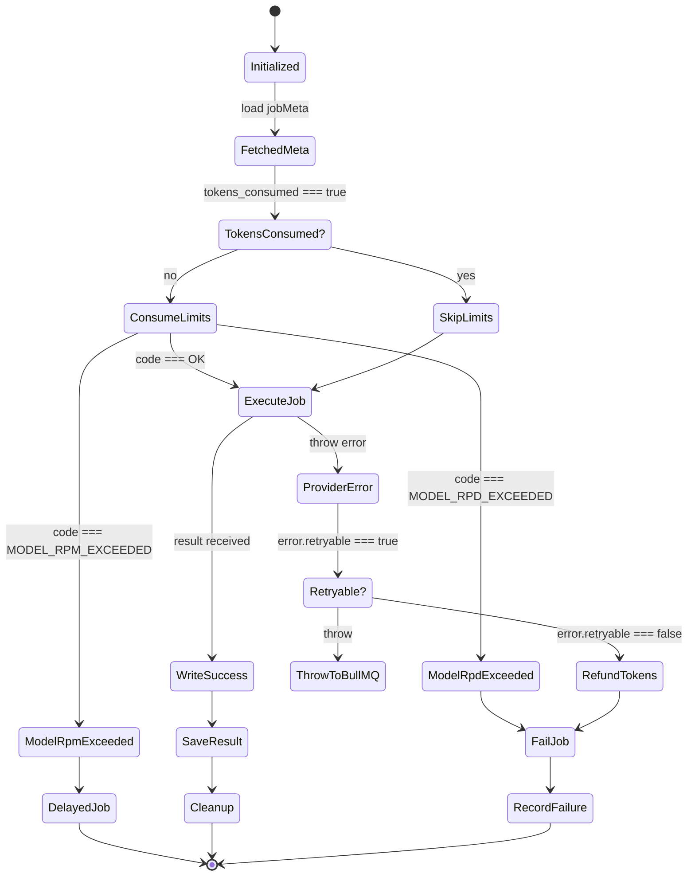

```mermaid
stateDiagram
  [*] --> Initialized

  Initialized --> FetchedMeta : load jobMeta

  FetchedMeta --> TokensConsumed? : tokens_consumed === true
  TokensConsumed? --> SkipLimits : yes
  TokensConsumed? --> ConsumeLimits : no

  ConsumeLimits --> ModelRpmExceeded : code === MODEL_RPM_EXCEEDED
  ModelRpmExceeded --> DelayedJob
  DelayedJob --> [*]

  ConsumeLimits --> ModelRpdExceeded : code === MODEL_RPD_EXCEEDED
  ModelRpdExceeded --> FailJob

  ConsumeLimits --> ExecuteJob : code === OK
  SkipLimits --> ExecuteJob

  ExecuteJob --> ProviderError : throw error
  ExecuteJob --> WriteSuccess : result received

  ProviderError --> Retryable? : error.retryable === true
  Retryable? --> ThrowToBullMQ : throw

  Retryable? --> RefundTokens : error.retryable === false
  RefundTokens --> FailJob

  WriteSuccess --> SaveResult
  SaveResult --> Cleanup
  Cleanup --> [*]

  FailJob --> RecordFailure
  RecordFailure --> [*]
```