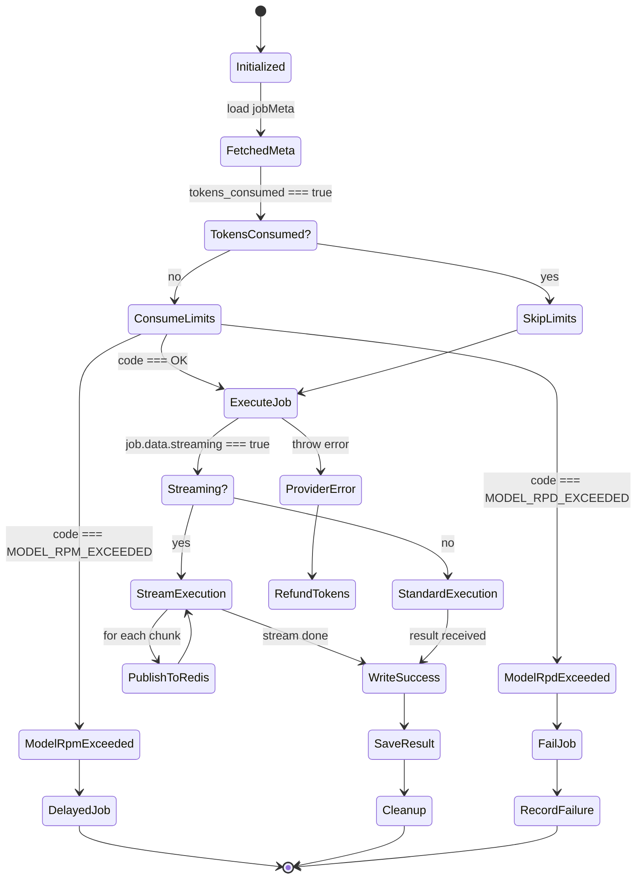

## Streaming Logic in Worker

If the `streaming` flag is set to `true` in the job data:

1. The worker uses `ModelProviderService.executeStream`.
2. Each yielded chunk is published to Redis Pub/Sub channel `job:stream:{jobId}` as a JSON string: `{"type": "chunk", "data": "..."}`.
3. Once the stream ends, a `{"type": "done"}` message is published.
4. If an error occurs during streaming, an `{"type": "error", ...}` message is published, and the worker throws the error to trigger standard BullMQ retry/fail logic.
5. Even during streaming, the worker aggregates the full response text to ensure `finalizeSuccess` can save the complete result to Redis/DB for consistency.
